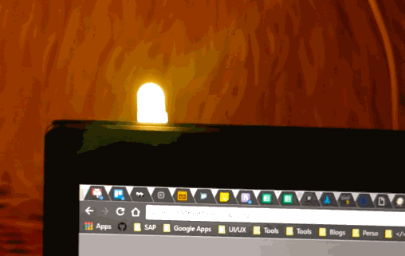

# flip

*Switch on a RGB LED (e.g. Slack=Green ; SublimeText=Red ; Word=Orange) following...*  
 *- option1, the current user window*  
 *- option2, the skype status (away, busy, available, in a meeting, presenting...)*  
 *- option3, manually with a physical button*  

  

### Application information

### Install

 - Order all the things *(Wemos, stripes, button, RGB led, ...)* 
 - Print 3D models (globe & boxes)
 - Put the whole together
 - Connect the Wemos using a micro USB cable to your laptop
 - Upload the .ino code *(adapt with your WiFi credentials)*
 - Unplug from your laptop and connnect somewhere visible on top of your office 
 - Launch the program on your laptop *(it will create an MQTT connection and send data to the wemos)*
 - Enjoy

### Launch

## OSX

First install dependencies 

	sudo easy_install pip
	sudo pip install paho-mqtt

Now, run the script 

	python run.py

### Physical device

 - 1x Wemos
 - 1x LED RGB
 - 1x Push button
 - 1x Micro USB power supply

### Connections

##### RGB LED & Node MCU

*here, add photo*  

### 3D Printing

 - [Box for Nodemcu](https://www.thingiverse.com/thing:1128026)

### Useful links

 - [Github | MQTT-ESP8266-CLOUDMQTT.COM/example.ino](https://github.com/Protoneer/MQTT-ESP8266-CLOUDMQTT.COM/blob/master/example.ino)

### Licence 

MIT © <a href="http://joeybronner.fr">Joey Bronner</a>
